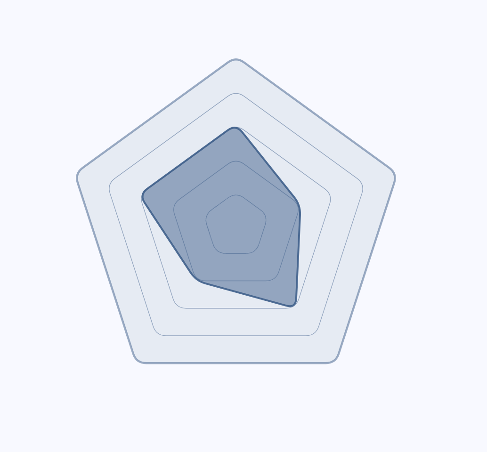

# Radar Diagram

A customizable Flutter package for drawing radar (spider) charts. Visualize multivariate data in a clear, interactive, and beautiful way. Perfect for displaying skill sets, performance metrics, or any data that benefits from a radar/spider chart representation.



## Features

- Draw radar (spider) charts with any number of axes
- Customizable colors, labels, and data points
- Interactive and animated chart rendering
- Easy integration into any Flutter app
- Responsive and supports both light and dark themes

## Getting started

Add `radar_diagram` to your `pubspec.yaml`:

```yaml
dependencies:
  radar_diagram: 1.0.0
```

Then run:

```sh
flutter pub get
```

## Usage

Import the package and use the `RadarDiagram` widget:

```dart
import 'package:radar_diagram/radar_diagram.dart';

RadarDiagram(
    values: [3, 2, 3, 2, 3],
    axes: 5,
    levels: 5,
    dataFillColor: Colors.blue,
)

```

For more advanced usage and customization, see the [example](example/) folder.